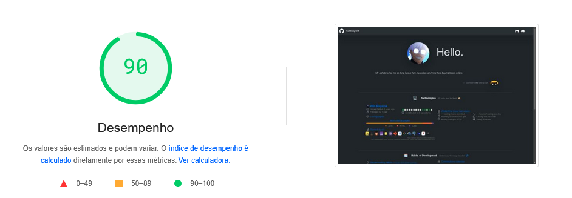

# Seja bem vindo! 🫶

> Esta é minha página no Github Pages. Ela é totalmente baseada em estatística derivadas do **[`@lowlighter`](https://github.com/lowlighter)**.
 
> [!IMPORTANT]
> Utilize os códigos fonte à vontade, porém aconselho se basear sempre no **[`branch:main`](https://github.com/lowlighter/metrics)** do próprio desenvolvedor. 

> [!WARNING]
> Se atente apenas à área de [`issues`](https://github.com/lowlighter/metrics/issues) para conferir funcionalidades que estão passando por instabilidade.
> _Responderei dúvidas caso esteja na dúvida entre erro de código ou funcionalidade fora do ar._\
> **Entre em contato por mensagem no [`Discord`](https://discordapp.com/users/216675974249578497)**

### PageSpeed Insight 💹
> 

