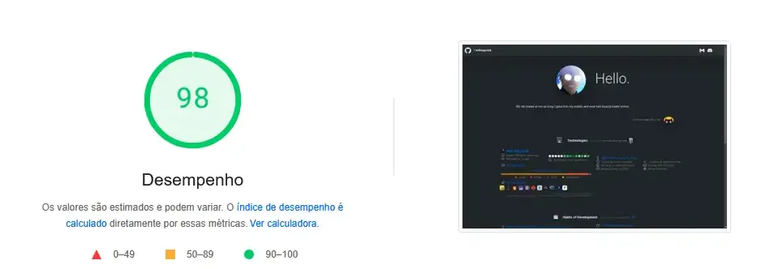

# Seja bem vindo! 🫶

> Esta é minha página no Github Pages. Ela é totalmente baseada em estatística derivadas do **[`@lowlighter`](https://github.com/lowlighter)**.
 
> [!IMPORTANT]
> Utilize os códigos fonte à vontade, porém aconselho se basear sempre no **[`branch:main`](https://github.com/lowlighter/metrics)** do próprio desenvolvedor. 

> [!WARNING]
> Se atente apenas à área de [`issues`](https://github.com/lowlighter/metrics/issues) para conferir funcionalidades que estão passando por instabilidade.
> _Responderei dúvidas caso esteja na dúvida entre erro de código ou funcionalidade fora do ar._\
> **Entre em contato por mensagem no [`Discord`](https://discordapp.com/users/216675974249578497)**

---

### PageSpeed Insight 💹
[_`@lowlighter`_](https://github.com/lowlighter)

> [!TIP]
> Estou tentando melhorar o score das páginas através de ajustes de boas práticas e principalmente ajuste de arquivos e visualizações; assim como algumas tags sendo renderizadas com um certo delay.

_`08/04/2025`_

> 

---

`13/04/2025` [`🔗`](https://pagespeed.web.dev/analysis/https-willmayrink-github-io/r4wzsi6j29?form_factor=desktop)

> 

